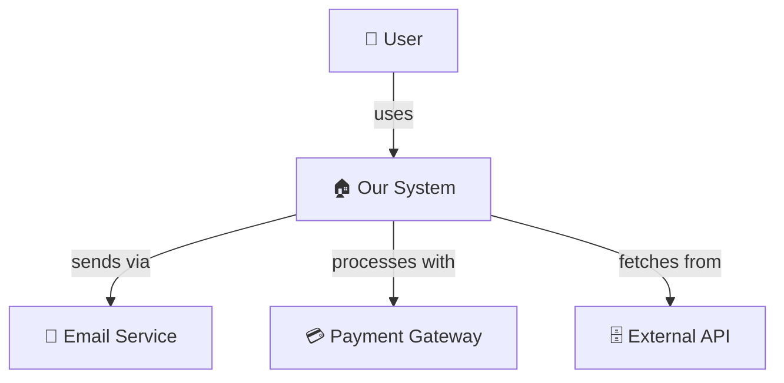
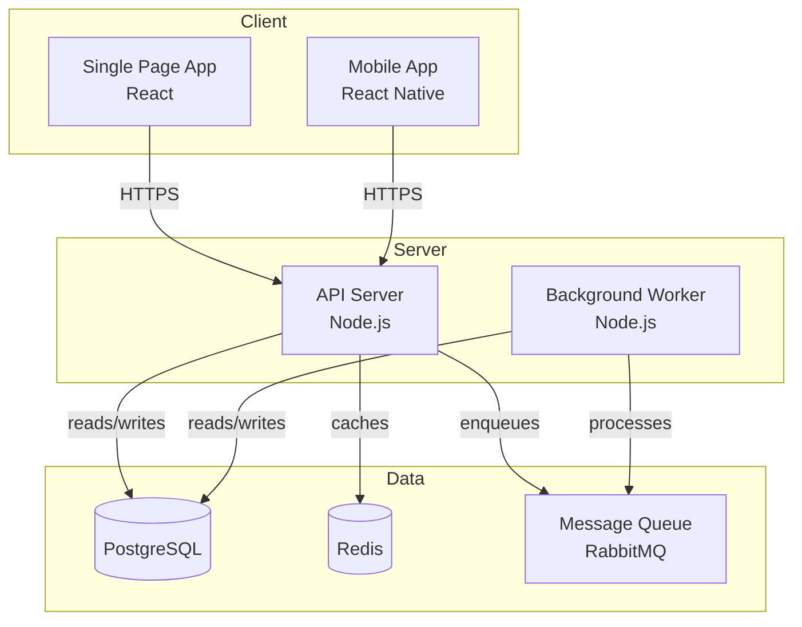
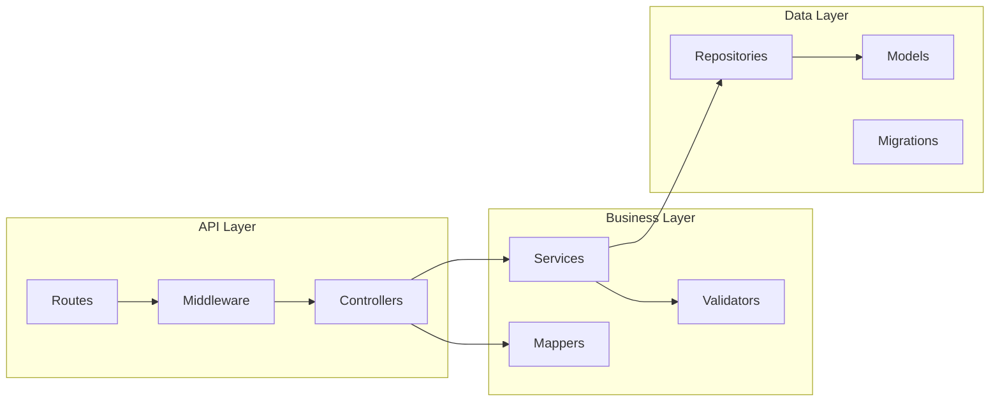
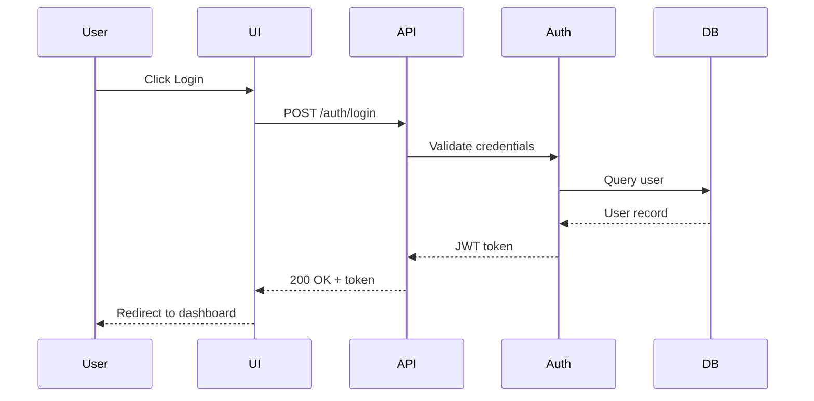
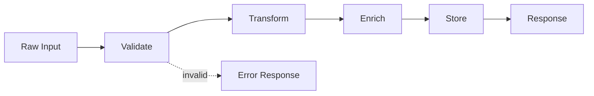
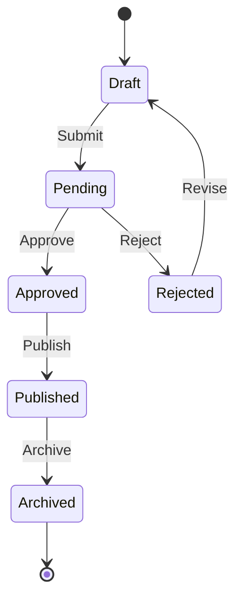
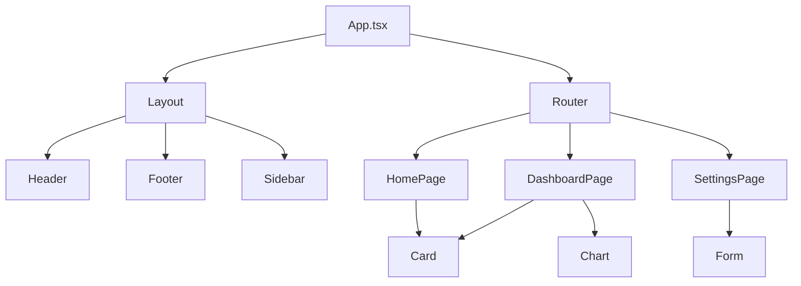

# Diagram Patterns for Project Guide

Reusable diagram templates for architecture visualization. Use Mermaid for rich rendering, ASCII for terminal/plain-text contexts.

---

## System Context Diagrams

Show how the project fits in its broader ecosystem.

### Mermaid



### ASCII

```
                    ┌─────────────┐
                    │    User     │
                    └──────┬──────┘
                           │ uses
                           ▼
    ┌──────────────────────────────────────┐
    │            Our System                │
    └──────────────────────────────────────┘
         │              │              │
         │ sends        │ processes    │ fetches
         ▼              ▼              ▼
    ┌─────────┐   ┌───────────┐   ┌─────────┐
    │  Email  │   │  Payment  │   │ Ext API │
    │ Service │   │  Gateway  │   │         │
    └─────────┘   └───────────┘   └─────────┘
```

---

## Container Diagrams

Show major deployable units and their relationships.

### Mermaid



### ASCII

```
┌─────────────────────────────────────────────────────────────┐
│                         Client                              │
│   ┌─────────────────┐         ┌─────────────────┐          │
│   │   Web App       │         │   Mobile App    │          │
│   │   (React)       │         │   (React Native)│          │
│   └────────┬────────┘         └────────┬────────┘          │
└────────────┼───────────────────────────┼────────────────────┘
             │ HTTPS                     │ HTTPS
             └───────────┬───────────────┘
                         ▼
┌─────────────────────────────────────────────────────────────┐
│                         Server                              │
│   ┌─────────────────┐         ┌─────────────────┐          │
│   │   API Server    │────────▶│ Background      │          │
│   │   (Node.js)     │  queue  │ Worker          │          │
│   └────────┬────────┘         └────────┬────────┘          │
└────────────┼───────────────────────────┼────────────────────┘
             │                           │
             ▼                           ▼
┌─────────────────────────────────────────────────────────────┐
│                          Data                               │
│   ┌──────────┐    ┌──────────┐    ┌──────────┐             │
│   │PostgreSQL│    │  Redis   │    │ RabbitMQ │             │
│   │    DB    │    │  Cache   │    │  Queue   │             │
│   └──────────┘    └──────────┘    └──────────┘             │
└─────────────────────────────────────────────────────────────┘
```

---

## Component Diagrams

Show internal structure of a subsystem.

### Mermaid



### ASCII

```
┌──────────────────────── API Layer ────────────────────────┐
│                                                            │
│   ┌──────────┐    ┌────────────┐    ┌─────────────┐       │
│   │  Routes  │───▶│ Middleware │───▶│ Controllers │       │
│   └──────────┘    └────────────┘    └──────┬──────┘       │
│                                            │               │
└────────────────────────────────────────────┼───────────────┘
                                             │
                                             ▼
┌─────────────────── Business Layer ─────────────────────────┐
│                                                            │
│   ┌────────────┐    ┌────────────┐    ┌──────────┐        │
│   │  Services  │───▶│ Validators │    │  Mappers │        │
│   └─────┬──────┘    └────────────┘    └──────────┘        │
│         │                                                  │
└─────────┼──────────────────────────────────────────────────┘
          │
          ▼
┌──────────────────── Data Layer ────────────────────────────┐
│                                                            │
│   ┌──────────────┐    ┌──────────┐    ┌────────────┐      │
│   │ Repositories │───▶│  Models  │    │ Migrations │      │
│   └──────────────┘    └──────────┘    └────────────┘      │
│                                                            │
└────────────────────────────────────────────────────────────┘
```

---

## Sequence Diagrams

Show interactions over time.

### Mermaid



### ASCII

```
User        UI          API         Auth        DB
 │           │           │           │          │
 │──Click───▶│           │           │          │
 │           │──POST────▶│           │          │
 │           │ /login    │──Validate▶│          │
 │           │           │           │──Query──▶│
 │           │           │           │◀─User────│
 │           │           │◀──JWT─────│          │
 │           │◀──200 OK──│           │          │
 │◀─Redirect─│           │           │          │
 │           │           │           │          │
```

---

## Data Flow Diagrams

Show how data transforms through the system.

### Mermaid



### ASCII

```
┌───────────┐   ┌──────────┐   ┌───────────┐   ┌────────┐   ┌───────┐
│ Raw Input │──▶│ Validate │──▶│ Transform │──▶│ Enrich │──▶│ Store │
└───────────┘   └────┬─────┘   └───────────┘   └────────┘   └───┬───┘
                     │                                          │
                     │ invalid                                  │
                     ▼                                          ▼
               ┌───────────┐                              ┌──────────┐
               │   Error   │                              │ Response │
               │ Response  │                              └──────────┘
               └───────────┘
```

---

## State Diagrams

Show lifecycle states of an entity.

### Mermaid



### ASCII

```
                    ┌─────────┐
                    │  Draft  │◀──────────┐
                    └────┬────┘           │
                         │ submit         │ revise
                         ▼                │
                    ┌─────────┐           │
              ┌─────│ Pending │───────────┤
              │     └─────────┘           │
              │ approve                   │
              ▼                           │
        ┌──────────┐    reject      ┌──────────┐
        │ Approved │                │ Rejected │
        └────┬─────┘                └──────────┘
             │ publish
             ▼
        ┌───────────┐
        │ Published │
        └─────┬─────┘
              │ archive
              ▼
        ┌──────────┐
        │ Archived │
        └──────────┘
```

---

## Folder Structure Diagrams

Show project organization.

### Standard Format

```
project-root/
├── src/
│   ├── components/      # UI components
│   ├── hooks/           # Custom React hooks
│   ├── lib/             # Utility libraries
│   │   ├── api/         # API client
│   │   └── utils/       # Helpers
│   ├── pages/           # Route pages
│   └── types/           # TypeScript types
├── tests/
│   ├── unit/            # Unit tests
│   └── integration/     # Integration tests
├── config/              # Configuration files
├── scripts/             # Build/deploy scripts
└── docs/                # Documentation
```

### With File Counts

```
project-root/
├── src/                 (147 files)
│   ├── components/      (52 files)  ████████████
│   ├── hooks/           (12 files)  ███
│   ├── lib/             (28 files)  ███████
│   ├── pages/           (35 files)  █████████
│   └── types/           (20 files)  █████
├── tests/               (89 files)
│   ├── unit/            (67 files)  █████████████████
│   └── integration/     (22 files)  ██████
└── config/              (8 files)   ██
```

---

## Dependency Graphs

Show module dependencies.

### Mermaid



### ASCII

```
                          App.tsx
                         /       \
                    Layout       Router
                   /  |  \        /  |  \
            Header Footer Sidebar   |   |
                                  Home  |
                                  /   Dashboard
                              Card    /    \
                                   Card    Chart
                                          Settings
                                             |
                                           Form
```

---

## Tips for Effective Diagrams

### Do ✅

- Label relationships with verbs
- Show data flow direction
- Group related components
- Use consistent notation
- Include a legend when needed

### Don't ❌

- Cram too much into one diagram
- Use vague labels like "stuff" or "data"
- Mix abstraction levels
- Forget to show external systems
- Create diagrams without context

### Choosing the Right Diagram

| Question | Diagram Type |
|----------|--------------|
| How does this fit in the ecosystem? | System Context |
| What are the major parts? | Container |
| How is this subsystem organized? | Component |
| What happens over time? | Sequence |
| How does data transform? | Data Flow |
| What states can this be in? | State |
| How are files organized? | Folder Structure |
| What depends on what? | Dependency Graph |
